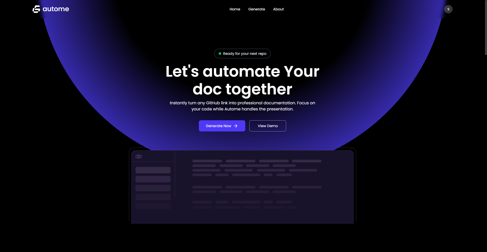
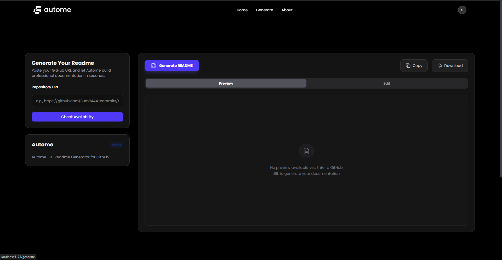
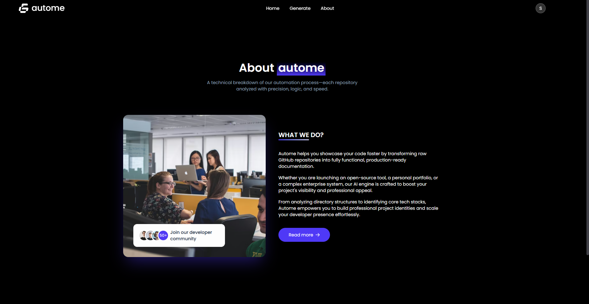

# Autome 

## Elevating Documentation with AI-Driven Precision

[](https://opensource.org/licenses/MIT)


Autome is a sophisticated, AI-powered documentation engine designed to streamline the creation of high-fidelity GitHub READMEs. By leveraging the Google Gemini API and GitHub's Octokit, Autome analyzes repository structures and source code to generate professional, context-aware documentation in seconds.


---

## 🖼️ App Preview




<!-- 
Developer Note: To update this preview:
1. Capture a high-resolution screenshot of the dashboard/editor.
2. Upload it to your repository's 'public/assets' or an image hosting service.
3. Replace the URL above with the actual path.
-->

---

## 🚀 Key Features

*   **AI-Powered Content Generation:** Utilizes `@google/genai` (Gemini) to synthesize complex codebases into human-readable documentation.
*   **Direct GitHub Integration:** Seamlessly fetches repository metadata and file structures using the official `Octokit` client.
*   **Interactive Monaco Editor:** Features a professional-grade code editing experience powered by `@monaco-editor/react` with syntax highlighting.
*   **Real-time Markdown Preview:** Instant visual feedback using `@uiw/react-markdown-preview` to ensure documentation looks perfect before deployment.
*   **High-Fidelity UI/UX:** Implements `Framer Motion` for fluid animations and `Lenis` for ultra-smooth kinetic scrolling.
*   **Secure Authentication & Validation:** Robust backend security utilizing `Bcryptjs` for hashing and `Zod` for strict schema-based request validation.

---

## 🛠 Technology Stack

### Frontend
| Tool | Purpose | Version |
| :--- | :--- | :--- |
| **React** | Component-based UI Library | `^19.1.1` |
| **Vite** | Next-generation Frontend Tooling | `^7.1.7` |
| **Tailwind CSS** | Utility-first CSS Framework | `^4.1.14` |
| **Framer Motion** | Motion Library for React | `^12.23.22` |
| **Monaco Editor** | Web-based Code Editor | `^4.7.0` |

### Backend & AI
| Tool | Purpose | Version |
| :--- | :--- | :--- |
| **Express** | Node.js Web Framework | `^5.2.1` |
| **Mongoose** | MongoDB Object Modeling | `^9.1.5` |
| **Google GenAI** | Gemini AI Orchestration | `^1.38.0` |
| **Octokit** | GitHub API Client | `^5.0.5` |
| **Zod** | TypeScript-first Schema Validation | `^4.3.6` |

---

## 📂 Directory Structure

```ascii
.
├── Frontend/
│   ├── src/
│   │   ├── components/      # Reusable UI components (Navbar, Footer, Editor)
│   │   ├── context/         # Global State Management (Auth, Store)
│   │   ├── hooks/           # Custom React hooks for logic reuse
│   │   ├── pages/           # Main route views (Home, Generate, About)
│   │   ├── sections/        # Modular landing page sections
│   │   └── configs/         # API and environment configurations
│   └── vite.config.js       # Frontend build configuration
├── server/
│   ├── config/              # DB, AI, and Octokit initialization logic
│   ├── controllers/         # Business logic & request handling
│   ├── middlewares/         # Auth, Error handling, and Validation filters
│   ├── models/              # MongoDB/Mongoose schemas (User)
│   ├── routes/              # Express API endpoints mapping
│   ├── validate/            # Zod validation schemas
│   └── server.js            # Application entry point
└── README.md
```

---

## ⚙️ Getting Started

### Prerequisites
*   Node.js (v18 or higher)
*   MongoDB Instance
*   Google Gemini API Key
*   GitHub Personal Access Token

### Installation

1.  **Clone the Repository:**
    ```bash
    git clone https://github.com/Sumit444-commits/autome.git
    cd autome
    ```

2.  **Setup Backend:**
    ```bash
    cd server
    npm install
    # Create a .env file based on the keys below
    npm run dev
    ```

3.  **Setup Frontend:**
    ```bash
    cd ../Frontend
    npm install
    npm run dev
    ```

### Environment Variables
Ensure the following keys are defined in your environment:

**Server (`server/.env`):**
*   `PORT`: Port number for the server.
*   `MONGODB_URI`: Your MongoDB connection string.
*   `GEMINI_API_KEY`: API key from Google AI Studio.
*   `GITHUB_TOKEN`: GitHub Personal Access Token for API access.
*   `JWT_SECRET`: Secret key for session signing.

**Frontend (`Frontend/.env`):**
*   `VITE_API_URL`: The URL where your backend server is running.

---

## 👤 Author

**Sumit Sharma**
Principal Developer of Autome.

*   **GitHub:** [@Sumit444-commits](https://github.com/Sumit444-commits)
*   **LinkedIn:** [https://www.linkedin.com/in/sumit-sharma-a0b2c7](https://www.linkedin.com/in/sumit-sharma-a0b2c7)
*   **Portfolio:** [sumitsharma.codes](https://sumitsharma.codes)

---

## 📄 License

This project is licensed under the **MIT License**. See the [LICENSE](LICENSE) file for details.

---
*Generated with ❤️ by Autome*